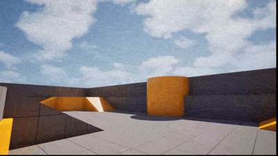

# 3D提示文字

ThreeDTextPrompt 是一个 UE5 运行时 3D 文字提示插件。
它可以在场景中生成一段 3D 文字，并让文字按字符依次弹出、跳起、缩放，灵感来自《米塔》。
插件基于 UE5 自带的 `Text3D` 插件实现。
插件内置了一个默认中文字体，复制插件后即可显示中文。

## 演示



## 安装方法

把插件目录复制到你的项目：

```text
YourProject/Plugins/ThreeDTextPrompt
```

然后：

1. 打开 UE 编辑器。
2. 启用插件 `ThreeDTextPrompt`。
3. 确认 UE 自带插件 `Text3D` 也已启用。
4. 重启编辑器。
5. 如果提示需要编译，重新编译项目。

## 蓝图使用方法

在蓝图中搜索节点：

```text
Show 3D Text Prompt
```

这个节点可以生成一段自定义 3D 文字。

常用参数：

- `Text`：要显示的文字
- `Location`：生成位置
- `Rotation`：生成朝向
- `Options`：文字样式和动画参数

如果想直接使用项目默认配置，可以用：

```text
Show 3D Text Prompt With Defaults
```

## C++ 使用方法

先在你的模块 `.Build.cs` 中添加依赖：

```csharp
PublicDependencyModuleNames.Add("ThreeDTextPrompt");
```

然后在代码中包含头文件：

```cpp
#include "ThreeDTextPromptFunctionLibrary.h"
```

示例：

```cpp
FThreeDTextPromptOptions Options;
Options.FontSize = 48.0f;
Options.JumpHeight = 24.0f;
Options.CharacterDelay = 0.08f;
Options.PopDuration = 0.28f;
Options.bFacePlayerCamera = true;

UThreeDTextPromptFunctionLibrary::Show3DTextPrompt(
    this,
    FText::FromString(TEXT("+100")),
    GetActorLocation() + FVector(0.0f, 0.0f, 120.0f),
    FRotator::ZeroRotator,
    Options
);
```

## 项目默认设置

可以在这里配置默认参数：

```text
Project Settings -> Game -> 3D Text Prompt
```

可以设置：

- 默认生成的 Prompt Actor 类
- 默认字体
- 默认材质
- 默认动画参数
- 默认音效

蓝图节点 `Show 3D Text Prompt With Defaults` 会直接使用这里的配置。

## 中文显示注意事项

插件内置默认中文字体，默认会优先使用：

```text
/ThreeDTextPrompt/Fonts/Unibit_Font.Unibit_Font
```

你也可以在项目设置中替换为自己的字体：

```text
Project Settings -> Game -> 3D Text Prompt -> Default Options -> Font
```

## 许可证

MIT License
